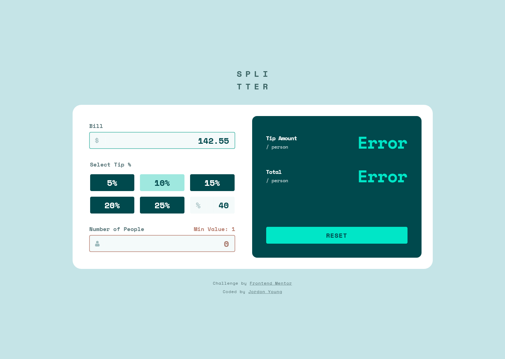
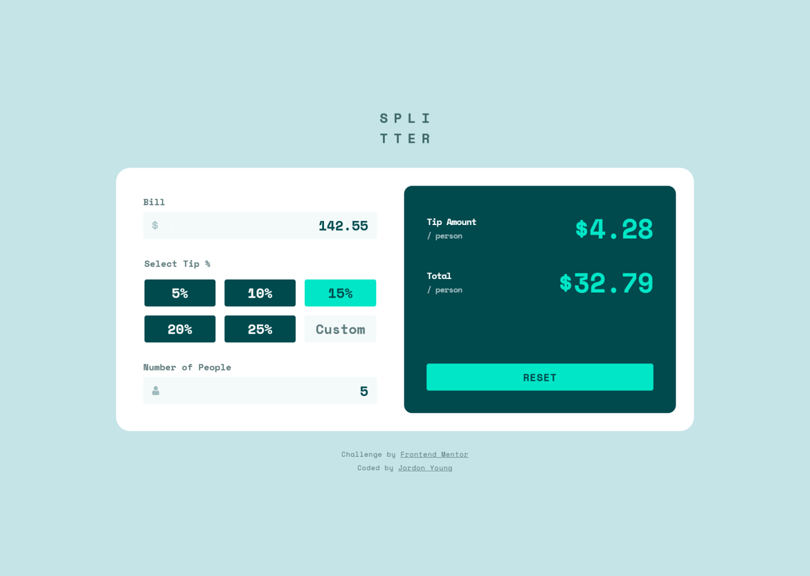
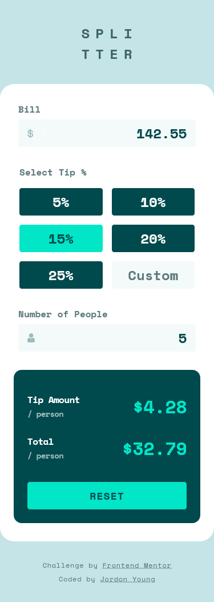

# Tip Calculator :money_with_wings:

This is a solution to the [Tip Calculator Challenge](https://www.frontendmentor.io/challenges/tip-calculator-app-ugJNGbJUX) by [Frontend Mentor](https://www.frontendmentor.io/).


<br />

# Table of contents

- [The Challenge](#the-challenge)
  - [Brief](#brief)
  - [Provided Resources](#provided-resources)
- [My process](#my-process)
  - [What I learned](#what-i-learned)
  - [Continued development](#continued-development)
  - [Useful resources](#useful-resources)
- [The Solution](#the-solution)
  - [Screenshots: Design vs. Solution](#screenshots-design-vs-solution)
  - [Technical Summary](#built-with)
    - HTML5
    - JavaScript Modules
    - CSS3 Media Queries
    - Styling with SCSS / SASS
- [Author](#author)
- [Links](#links)

<br/>

<br/>

# The Challenge

From the [Tip Calculator Challenge](https://www.frontendmentor.io/challenges/tip-calculator-app-ugJNGbJUX) page on Frontend Mentor's website:

> ## Brief
>
> Your challenge is to build out this tip calculator app and get it looking as close to the design as possible.
>
> You can use any tools you like to help you complete the challenge. So if you've got something you'd like to practice, feel free to give it a go.
>
> Users should be able to:
>
> - View the optimal layout for the app depending on their device's screen size
> - See hover states for all interactive elements on the page
> - Calculate the correct tip and total cost of the bill per person

<br />

## Provided Resources

- Starting File Structure
- Minimalistic [Style Guide](./assets/design/style-guide.md)
- Images Included in Design
- [Design Screenshots](./assets/design/)
  - Desktop
    - [Initial State](./assets/design/desktop-design-empty.jpg)
    - [Active States](./assets/design/active-states.jpg) (Hover, Active, Error)
    - [Completed Form](./assets/design/desktop-design-completed.jpg)
  - Mobile
    - [Completed Form](./assets/design/mobile-design.jpg)

<br />

# The Solution

## Original Design vs. Solution Screenshots

<br />

|    Desktop     |                                  Original                                  |                                    Solution                                     |
| :------------: | :------------------------------------------------------------------------: | :-----------------------------------------------------------------------------: |
| Initial State  |      |  |
| Active States  |             |  |
| Completed Form |  |      |

|     Mobile     |                            Original                             |                                  Solution                                  |
| :------------: | :-------------------------------------------------------------: | :------------------------------------------------------------------------: |
| Completed Form |  |  |

Refer to [Calculations](#calculations) for explanation on tip amount discrepancy.

<br />

## Calculations

Total Amount 142.55
Tip 15% (21.3825)
Tip / 5 = 4.2765 [rounding]=> $4.28 / person
Total + Tip = 163.9325
Total + Tip / 5 = 32.7865 [rounding]=> $32.79 / person

4.27 _ 5 => 21.35 != 21.3825 <= 4.2765 _ 5
4.28 \* 5 => 21.4 Also not equal, but overtips ~0.2 instead of under tipping 0.325

# Process

## Recreate Design

<br />

# Technical Summary

## Semantic HTML5

Content is organized using semantic tags whenever possible to aid screenreaders in understanding the document's information heirarchy.
When strictly presenational, generic tags, such as `<div>` and `<span>`, are used as they convey no inherent meaning to developers or assistive technologies.

I typically like to make use of `<section>`, but since there were no headings for `id="input-card"` and `id="display-card"`, and every input came with a label, it wasn't appropriate. I didn't see any value in nesting headings inside of labels.

### Semantic Tags in Document Stucture

```html
<!-- Selection from index.html --->

<body>
  <header>
    <!-- Logo --->
  </header>

  <main>
    <form id="tip-calculator">
      <div id="input-card">
        <!-- Input --->
      </div>
      <div id="display-card">
        <!-- Output & Reset --->
      </div>
    </form>
  </main>

  <footer>
    <!-- Attribution --->
  </footer>
</body>
```

### Using `<form>` Elements

`<input>` for user input :scream:; `<output>` for displaying calculated tip and total values. Screen readers automatically read when `<output>` value is changed.

```html
<!-- Selection from index.html;  Some attributes and elements removed. -->

<form id="tip-calculator">
  <div id="input-card">
    <!-- Amount Billed -->
    <input type="number" />

    <!-- Tip Percent -->
    <fieldset>
      <!-- Predefined -->
      <input type="radio" />
      <input type="radio" />
      <input type="radio" />
      <input type="radio" />
      <input type="radio" />
      <input type="radio" />

      <!-- Custom -->
      <input type="number" />
    </fieldset>

    <!-- Number of People -->
    <input type="number" />
  </div>

  <div id="display-card">
    <!-- Tip Amount -->
    <output id="tip-amount"></output>

    <!-- Total Amount -->
    <output id="total-amount"></output>

    <!-- Form Reset -->
    <input type="reset" />
  </div>
</form>
```

### Leveraging `<input>` Validity

Using attributes, the HTML validates the form and inputs. CSS styling and JavaScript execution in this project are tied directly to HTML input validation states and events.

```html
<!-- Selection from index.html; Some attributes removed. -->

<input id="amount-billed" type="number" step="0.01" min="0" max="1000000" />

<input id="number-of-people" type="number" min="1" max="100" />
```

### `<form>` Reset

Unexpectedly, the `input[type=reset]` button didn't work on iOS Safari/Chrome, so I had to create methods to manually clear `<input>` and reset `<output>` values.

## JavaScript

The [Tip Calculator JavaScript](./assets/scripts/) is organized into four modules.
Modules are used in this project primarily for organization, maintenance, and digestability.

### input_card.js

#### display_card.js

#### tip_calculator.js

#### setup.js

```js
import * as tip_calculator from "./tip_calculator.js";

// Initializes Event Listeners and Handlers
tip_calculator.watch();
```

- CSS3
  - Root font-size: 62.5%;
  - Element sizing with REM (256px => 25.6rem)
  - Media Queries
    - Mobile First (min-width)
    - Primary Input Hover Detection (hover: hover)
    - Prefers Reduced Motion overrides transitions
- SCSS / SASS (CSS3)
  - Partial files for theme, components, and layout
  - Mixins with content blocks for breakpoints and managing hover on primarily touch devices

### Notible Features

- Resp

**Note: These are just examples. Delete this note and replace the list above with your own choices**

## What I learned

Use this section to recap over some of your major learnings while working through this project. Writing these out and providing code samples of areas you want to highlight is a great way to reinforce your own knowledge.

To see how you can add code snippets, see below:

```html
<h1>Some HTML code I'm proud of</h1>
```

```css
.proud-of-this-css {
  color: papayawhip;
}
```

```js
const proudOfThisFunc = () => {
  console.log("🎉");
};
```

If you want more help with writing markdown, we'd recommend checking out [The Markdown Guide](https://www.markdownguide.org/) to learn more.

**Note: Delete this note and the content within this section and replace with your own learnings.**

### Continued development

Use this section to outline areas that you want to continue focusing on in future projects. These could be concepts you're still not completely comfortable with or techniques you found useful that you want to refine and perfect.

**Note: Delete this note and the content within this section and replace with your own plans for continued development.**

### Useful resources

- [Example resource 1](https://www.example.com) - This helped me for XYZ reason. I really liked this pattern and will use it going forward.
- [Example resource 2](https://www.example.com) - This is an amazing article which helped me finally understand XYZ. I'd recommend it to anyone still learning this concept.

**Note: Delete this note and replace the list above with resources that helped you during the challenge. These could come in handy for anyone viewing your solution or for yourself when you look back on this project in the future.**

## Author

- Website - [Add your name here](https://www.your-site.com)
- Frontend Mentor - [@yourusername](https://www.frontendmentor.io/profile/yourusername)
- Twitter - [@yourusername](https://www.twitter.com/yourusername)

**Note: Delete this note and add/remove/edit lines above based on what links you'd like to share.**

## Links

- [Github Repository (Public)](https://github.com/jordon-young/fem-tip-calculator)
- [Solution Live Site](https://jordon-young.github.io/fem-tip-calculator/)

### Development Scripts

```bash
sass -w ./assets/stylesheets/scss:./assets/stylesheets/css
```
