# Tip Calculator :money_with_wings:

[](https://jordon-young.github.io/fem-tip-calculator/)


This is a solution to the [Tip Calculator Challenge](https://www.frontendmentor.io/challenges/tip-calculator-app-ugJNGbJUX) by [Frontend Mentor](https://www.frontendmentor.io/).


## :book: Table of Contents

[:clipboard: The Challenge](#📋-the-challenge)

[:mag: My Process](#🔍-my-process)

[:white_check_mark: The Solution](#✅-the-solution)

[:link: Links](#🔗-links)

[:computer: Sass Watch Command](#💻-sass-watch-command)

<br/>

<br/>

## :clipboard: The Challenge

- [Brief](#brief)
- [FEM Provided Resources](#fem-provided-resources)
- [My Goals](#my-goals)

[:arrow_up: Table of Contents](#📖-table-of-contents)

### Brief

From the [Tip Calculator Challenge](https://www.frontendmentor.io/challenges/tip-calculator-app-ugJNGbJUX) page on Frontend Mentor's website:

> Your challenge is to build out this tip calculator app and get it looking as close to the design as possible.
>
> You can use any tools you like to help you complete the challenge. So if you've got something you'd like to practice, feel free to give it a go.
>
> Users should be able to:
>
> - View the optimal layout for the app depending on their device's screen size
> - See hover states for all interactive elements on the page
> - Calculate the correct tip and total cost of the bill per person

### FEM Provided Resources

- Starting File Structure
- Minimalistic [Style Guide](./assets/design/style-guide.md)
- Images Included in Design
- [Design Screenshots](./assets/design/) (Desktop, Active States, Mobile)

### My Goals

- Make the Design Responsive
- Use SCSS for Styling
- Overcome iOS Specific Challenges:
  - Sticky Hover on Touch
  - Request Specific Keyboard Layout per Input

## :mag: My Process

- [Recreating the Design](#recreating-the-design)
- [Making the Design Responsive](#making-the-design-responsive)
- [Structuring the Page with Semantic HTML](#structuring-the-page-with-semantic-html)
- [Styling with Sass (SCSS)](#styling-with-sass)
- [Making it Interactive with JavaScript](#making-it-interactive-with-javascript)

[:arrow_up: Table of Contents](#📖-table-of-contents)

### Recreating the Design

The first challenge when using the free version of Frontend Mentor is always to recreate the design as no design files are provided. The best way I've found to get accurate measurements is to recreate the design in Figma or Adobe XD.

From the ground up, I create and compose increasingly complex UI components. I save and reuse styles whenever possible to keep things organized and simple for the developer (me :smile:). Each time I use an instance of a component in a new, more complex component, I check how things resize, adding layout constraints as necessary.

The images below show the Figma components I used to build the design. A doted line surrounds each component and its variants.

_The beauty of using Figma components in this way is that a change in the original component populates everywhere that component is used (including inside other components)._

#### Input Components

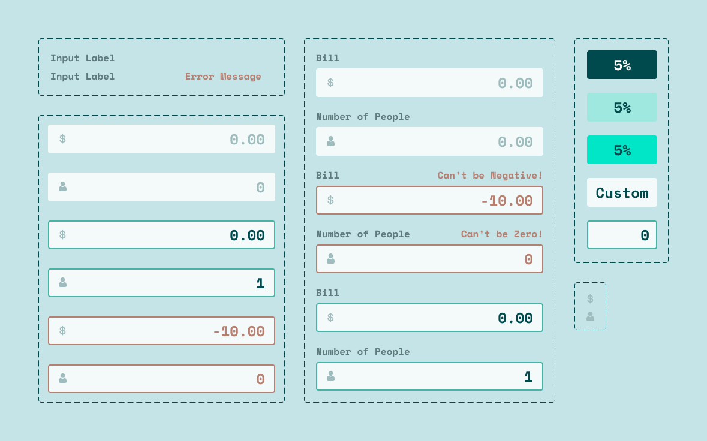

#### Input Card with Layouts

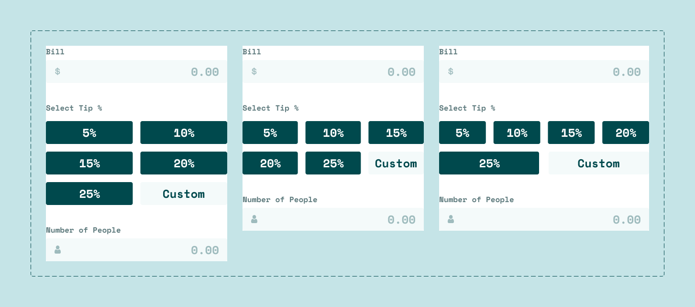

#### Display Card & Components

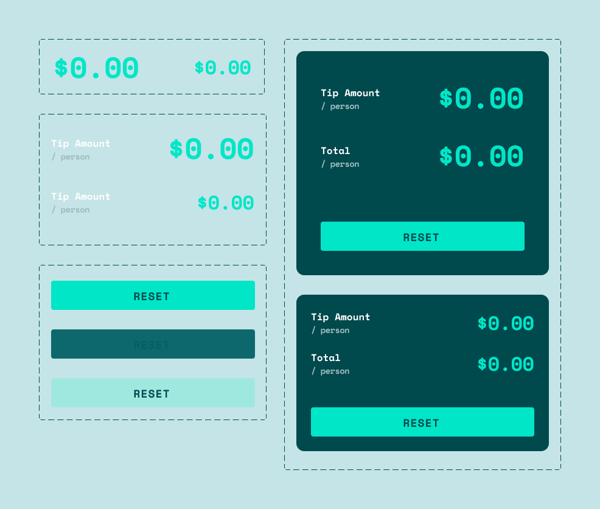

### Making the Design Responsive

Having only two fixed layouts is not fully embracing the spirit of responsive web design. I wanted the added challenge of developing several breakpoints, so I flexed my design muscles and specified how the page should resize using the mobile and desktop layouts as endpoints.

|                    Mobile Layout                    |                         Desktop Layout                          |
| :-------------------------------------------------: | :-------------------------------------------------------------: |
|  |  |

For project demonstration, I decided that fluidly transitioning between breakpoints (matching card widths) was the priority; this lead to the midpoint (720px to 875px) looking uncomfortably wide, but remembering that this is a coding challenge, I kept it simple.

| Breakpoint |                        Min-Width to Max-Width                         |
| :--------: | :-------------------------------------------------------------------: |
|   375px    | 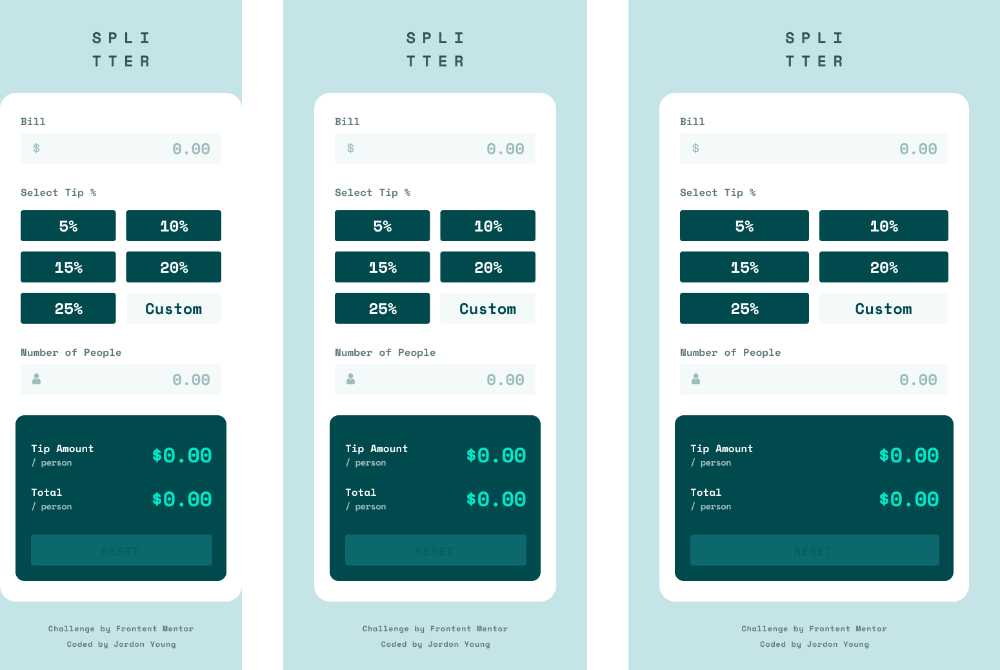 |
|   576px    | 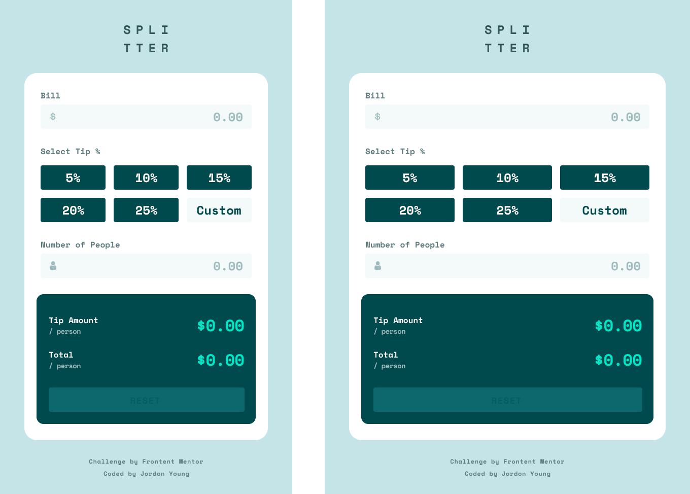 |
|   720px    | 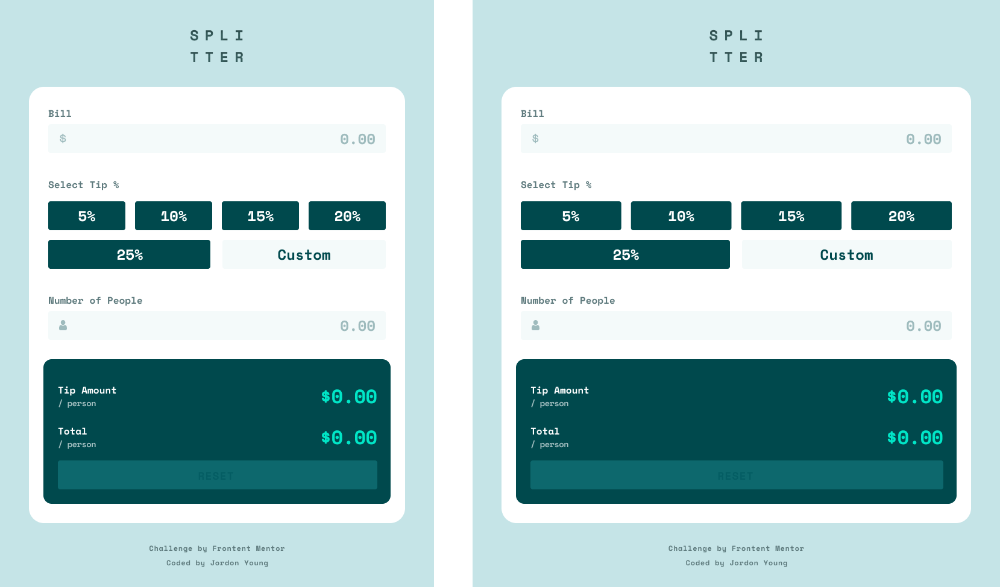 |
|   875px    | 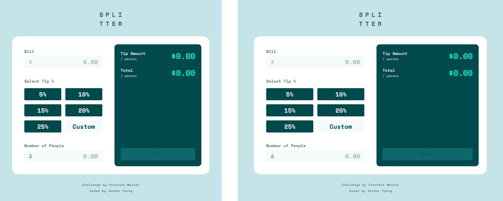 |
|   1047px   | 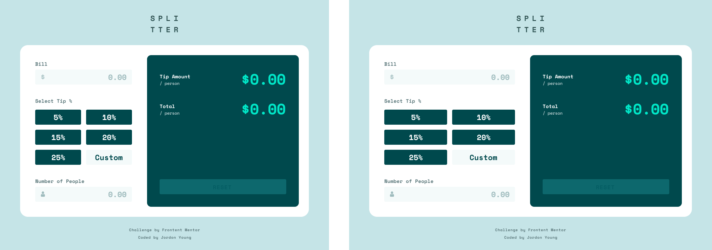 |
|   1155px   | 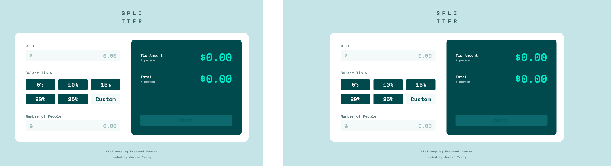 |

### Structuring the Page with Semantic HTML

Once the design was solidified, I began structuring the document. It's especially important to use semantic tags whenever possible to enable the use of assistive technologies. As is often the case, making the document more accessible makes every step in the development process simpler and easier.

#### Abbreviated Excerpt from index.html

Notice how the structure and use of semantic tags logically represent the composition of the design.

```html
<body>
  <header>
    <!-- Logo --->
  </header>

  <main>
    <form id="tip-calculator">
      <div id="input-card">
        <!-- Input --->
      </div>
      <div id="display-card">
        <!-- Output & Reset --->
      </div>
    </form>
  </main>

  <footer>
    <!-- Attribution --->
  </footer>
</body>
```

It's sometimes necessary to 'wrap' elements for styling purposes. When strictly presentational, generic tags, such as `<div>` and `<span>`, are used as they convey no inherent meaning to developers or assistive technologies.

The `id="input-card"` and `id="display-card"` elements could not be `<section>` tags because they do not have headings. [[Reference]](https://developer.mozilla.org/en-US/docs/Web/HTML/Element/section#usage_notes)

#### Abbreviated `<form id="tip-calculator">` Excerpt from index.html

By using `<form>` and `<input>`, I was able to take advantage of the [HTMLFormElement API](https://developer.mozilla.org/en-US/docs/Web/API/HTMLFormElement#methods) for client-side validation. If the `<input>`s are valid, the result will be placed in the `<output>`s, which are automatically read by screen readers on change.

```html
<form id="tip-calculator">
  <div id="input-card">
    <!-- Amount Billed -->
    <input type="number" />

    <!-- Tip Percent -->
    <fieldset>
      <!-- Predefined Tips -->
      <input type="radio" />
      <input type="radio" />
      <input type="radio" />
      <input type="radio" />
      <input type="radio" />
      <input type="radio" />

      <!-- Custom Tip Field -->
      <input type="number" />
    </fieldset>

    <!-- Number of People -->
    <input type="number" />
  </div>

  <div id="display-card">
    <!-- Tip Amount -->
    <output id="tip-amount"></output>

    <!-- Total Amount -->
    <output id="total-amount"></output>

    <!-- Form Reset -->
    <input type="reset" />
  </div>
</form>
```

Normally, using a `<form>` in this way would make it possible to easily reset the form state. Unfortunately, the default reset did not work on iOS (Chrome / Safari), so I had to create my own reset method anyways. :sleepy:

#### Completed Page without Styling

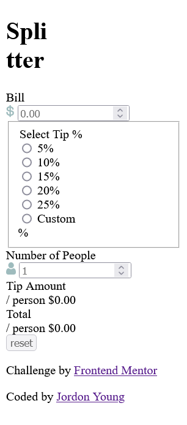

### Styling with Sass

This was my first time using Sass (SCSS) in a project, and it made abstraction and organization so much easier. My `styles.scss` file is a whopping three lines (complies to around 520 lines of CSS):

```scss
@use "theme";
@use "layout";
@use "components";
```

#### Theme

Forwarding and extending styles worked extremely well for my theme, and I learned a lot about how to set things up better in the future.

```scss
@forward "resets";
@forward "typography";
@forward "color";
@forward "transitions" as transition-*;
```

#### Layout

Positioning and sizing the tip calculator is done at the page level.

```scss
@forward "breakpoints";
@forward "page";
```

Using breakpoint mixins, I was able to write style changes directly next to those being overwritten.

##### Breakpoint Mixin Example from \_tip-calculator.scss

```scss
// Styles removed for simplicity.

#tip-calculator {
  /* Default Styles */
  /* Styles cascade like normal! */

  @include xs {
    /* Styles for the 'xs' breakpoint */
  }

  @include md {
    /* Styles for the 'md' breakpoint */
  }

  @include ml {
    /* Styles for the 'ml' breakpoint */
  }
}
```

I'll make the breakpoint names much more specific in the future. The generic names were confusing to work with. Component size media queries would take this to the next level. :pray:

#### Components

Just like the design and document structure, I styled each component separately, drawing shared styles, transitions, and variables from the theme.

```scss
@forward "input-card";
@forward "display-card";
@forward "tip-calculator";
```

### Making it Interactive with JavaScript

The [Tip Calculator JavaScript](./assets/scripts/) is organized into four modules, primarily for organization, maintenance, and digestibility. The code is written almost entirely in functions. If I were to refactor the code again, I would try to have one default export for each component.

#### setup.js

The only script directly linked in the document.

```js
import * as tip_calculator from "./tip_calculator.js";

// Initializes Event Listeners and Handlers
tip_calculator.watch();
```

#### tip_calculator.js

```js
import * as display_card from "./display_card.js";
import * as input_card from "./input_card.js";

function calculateTip(data) {...}

function handleFormChange() {...}

function resetForm(formId) {
  input_card.reset();
  display_card.reset();
  // {...}
}

export function watch(formId = "tip-calculator") {
  // Setup Event Listeners
  /* {...} */

  // Setup Component Event Listeners
  input_card.watch();
}
```

#### input_card.js

```js
const INPUT_CARD_ID = "input-card",
  AMOUNT_BILLED_ID = "amount-billed",
  CUSTOM_TIP_ID = "custom-tip",
  NUMBER_OF_PEOPLE_ID = "number-of-people";

const VALIDITY_STATES = {...};

/*
    Input Validation and Error Messages
*/
function displayErrorMessage(event) {...}

function removeErrorMessage(event) {...}

export function removeAllErrorMessages() {...}

function updateValidityMessage(event) {
  event.target.checkValidity() ? removeErrorMessage(event) : displayErrorMessage(event);
}

/*
    Amount Billed
*/
function formatAmountBilled(event) {...}

function getAmountBilled() {...}

function watchBilledAmount() {...}

/*
    Custom Tip Field
*/
function showCustomTipField() {...}

export function hideCustomTipField() {...}

function getTipPercent() {...}

function watchCustomTip() {...}

/*
    Number of People
*/
function getNumPeople() {...}

function watchNumPeople() {...}

/*
    Get Form Data for Calculations
*/
export function getFormData() {...}

/*
    Manually Reset Each Input ()
*/
export function reset() {...}

/*
    Input Card Setup
*/
export function watch() {
  watchBilledAmount();
  watchCustomTip();
  watchNumPeople();
}
```

#### display_card.js

```js
export const DISPLAY_CARD_ID = "display-card",
  TIP_OUTPUT_ID = "tip-amount",
  TOTAL_OUTPUT_ID = "total-amount",
  FONT_SIZE_PER_CH = 1.6;

// Responsively Fit Output Font-Size Based on Output Value Length
export function fitOutputText(id) {
  /* {...} */
}

export function displayOutput(id, amount) {
  /* {...} */
}

/*
    Setup & Reset
*/
export function enableResetButton() {
  /* {...} */
}

function disableResetButton() {
  /* {...} */
}

function resetOutputFontSize(id) {
  /* {...} */
}

export function reset() {
  disableResetButton();
  resetOutputFontSize(TIP_OUTPUT_ID);
  resetOutputFontSize(TOTAL_OUTPUT_ID);
}
```

## :white_check_mark: The Solution

- [Interactions & Functionality](#interactions--functionality)
- [Original Design vs. Solution Screenshots](#original-design-vs-solution-screenshots)

[:arrow_up: Table of Contents](#📖-table-of-contents)

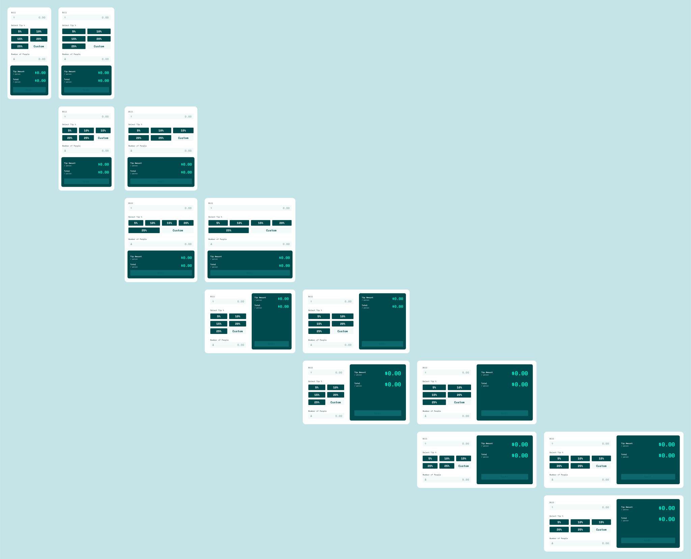

### Interactions & Functionality

| Input Card           |                                                                      |
| :------------------- | :------------------------------------------------------------------- |
| Input Focus          | 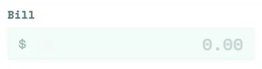           |
| Input Error          | 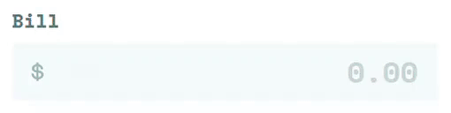 |
| Tip Hover            | 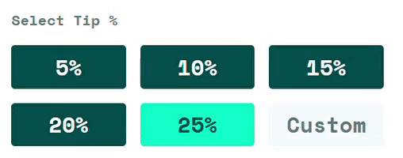          |
| Show/Hide Custom Tip | 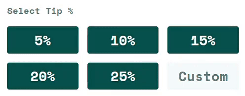       |

| Display Card      |                                                                         |
| :---------------- | :---------------------------------------------------------------------- |
| Live Calculations | 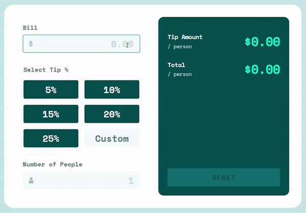           |
| Invalid Input     | 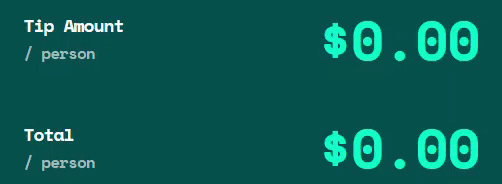              |
| Responsive Text   | 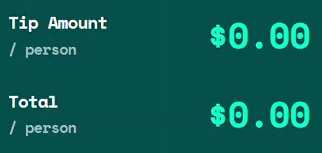   |
| Reset Button      | 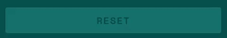 |

| Tip Calculator      |                                                                                   |
| :------------------ | :-------------------------------------------------------------------------------- |
| Responsive Layout   |                        |
| Keyboard Navigation | 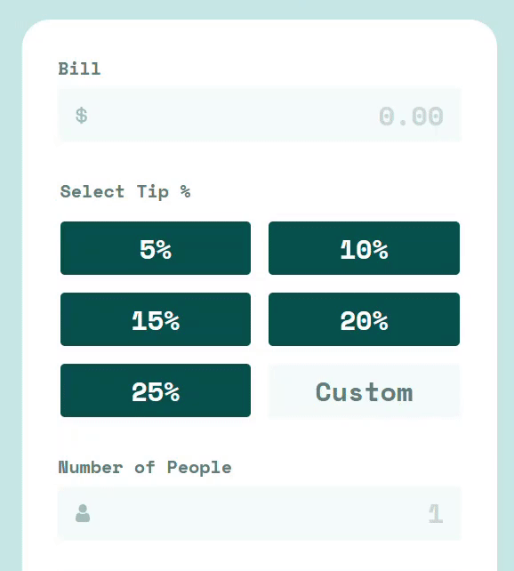 |

### Original Design vs. Solution Screenshots

|    Desktop     |                                  Original                                  |                                    Solution                                     |
| :------------: | :------------------------------------------------------------------------: | :-----------------------------------------------------------------------------: |
| Initial State  |      | 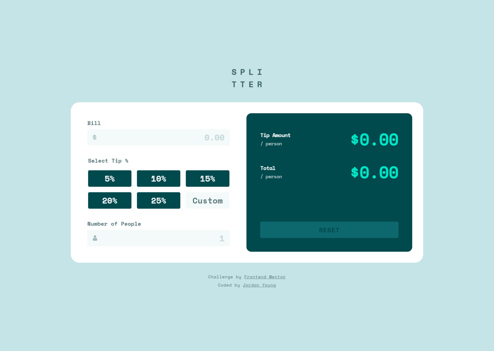 |
| Active States  |             |  |
| Completed Form |  |      |

|     Mobile     |                            Original                             |                                  Solution                                  |
| :------------: | :-------------------------------------------------------------: | :------------------------------------------------------------------------: |
| Completed Form | 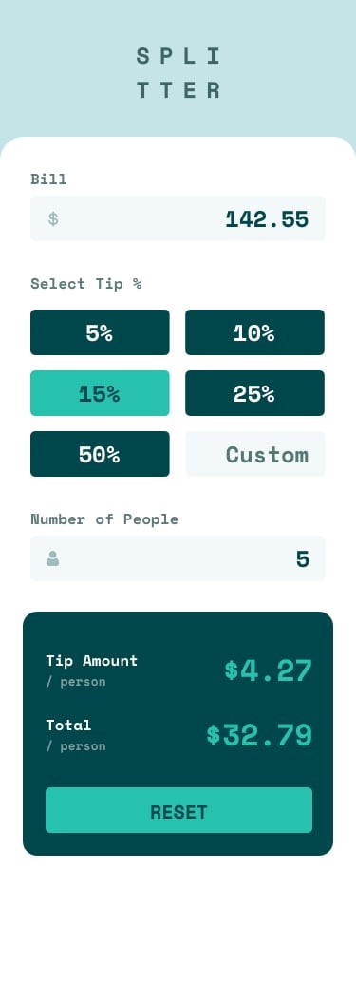 | 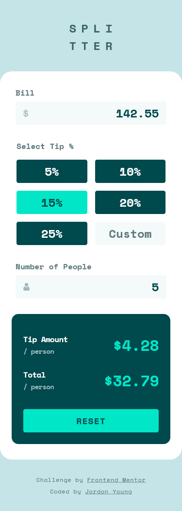 |

## :link: Links

[:arrow_up: Table of Contents](#📖-table-of-contents)

### Author

- Github Profile - [Jordon Young](https://github.com/jordon-young/)
- Frontend Mentor - [@jordon-young](https://www.frontendmentor.io/profile/jordon-young)

### Project

- [Github Repository (Public)](https://github.com/jordon-young/fem-tip-calculator)
- [Solution Live Site](https://jordon-young.github.io/fem-tip-calculator/)

## 💻 Sass Watch Command

```bash
sass -w ./assets/stylesheets/scss:./assets/stylesheets/css
```
