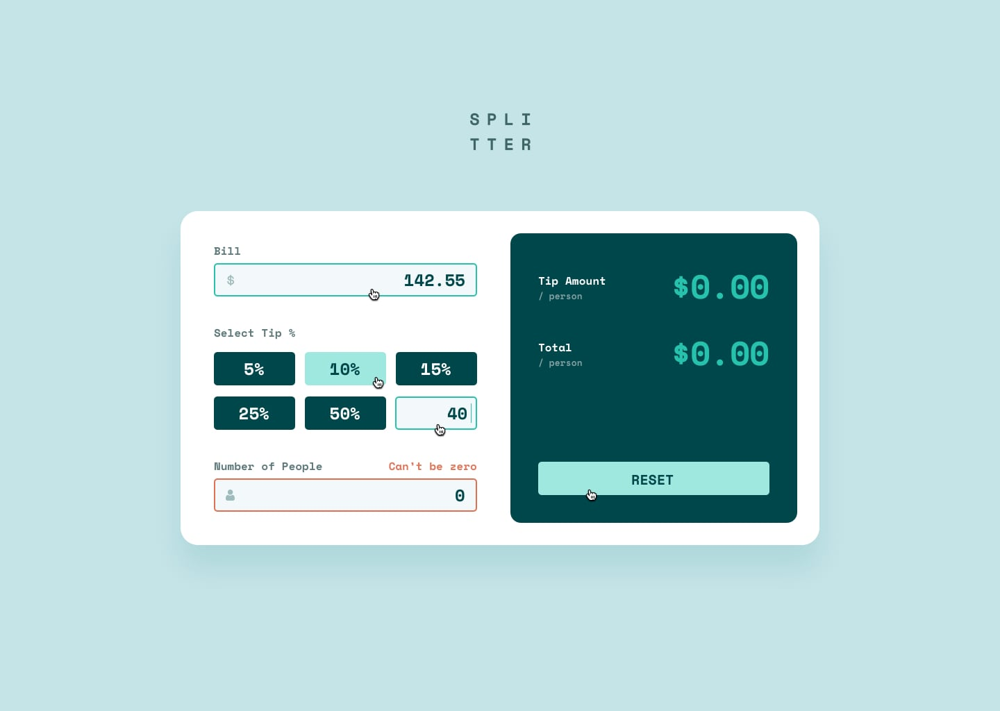

# Tip Calculator :money_with_wings:

[](https://jordon-young.github.io/fem-tip-calculator/)


This is a solution to the [Tip Calculator Challenge](https://www.frontendmentor.io/challenges/tip-calculator-app-ugJNGbJUX) by [Frontend Mentor](https://www.frontendmentor.io/).


## :book: Table of Contents

[:clipboard: The Challenge](#📋-the-challenge)

[:mag: Design Revisions](#🔍-design-revisions)

[:white_check_mark: The Solution](#✅-the-solution)

[:link: Links](#🔗-links)

[Sass Watch Command](#sass-watch-command)

<br/>

<br/>

## :clipboard: The Challenge

[:arrow_up: Table of Contents](#📖-table-of-contents)

- [Official Brief](#official-brief)
- [Starting Resources](#starting-resources)
- [My Requirements](#my-requirements)

### Official Brief

From the [Tip Calculator Challenge](https://www.frontendmentor.io/challenges/tip-calculator-app-ugJNGbJUX) page on Frontend Mentor's website:

> Your challenge is to build out this tip calculator app and get it looking as close to the design as possible.
>
> You can use any tools you like to help you complete the challenge. So if you've got something you'd like to practice, feel free to give it a go.
>
> Users should be able to:
>
> - View the optimal layout for the app depending on their device's screen size
> - See hover states for all interactive elements on the page
> - Calculate the correct tip and total cost of the bill per person

### Starting Resources

Frontend Mentor

- Starting File Structure
- Minimalistic [Style Guide](./assets/design/style-guide.md)
- Images Included in Design
- [Design Screenshots](./assets/design/)
  - Desktop
    - [Initial State](./assets/design/desktop-design-empty.jpg)
    - [Active States](./assets/design/active-states.jpg) (Hover, Active, Error)
    - [Completed Form](./assets/design/desktop-design-completed.jpg)
  - Mobile
    - [Completed Form](./assets/design/mobile-design.jpg)

### My Goals

- Make the Design Responsive
- Use SCSS for Styling
- Treat :hover Correctly on iOS (Chrome & Safari)

## :mag: Design Revisions

[:arrow_up: Table of Contents](#📖-table-of-contents)

### Recreating the Design in Figma

|                           |                                                                                       |
| :-----------------------: | :-----------------------------------------------------------------------------------: |
|       Input Pieces        |      |
|    Input Card Layouts     |                          |
| Display Card & Components |  |

### Making the Design Responsive

| Min-Width |                         Min-Width / Max-Width                         |
| :-------: | :-------------------------------------------------------------------: |
|   375px   |  |
|   576px   |  |
|   720px   |  |
|   875px   |  |
|  1047px   |  |
|  1155px   |  |

## :white_check_mark: The Solution

[:arrow_up: Table of Contents](#📖-table-of-contents)


### Interactions & Functionality

| Input Card           |                                                                      |
| :------------------- | :------------------------------------------------------------------- |
| Input Focus          |            |
| Input Error          |  |
| Tip Hover            |           |
| Show/Hide Custom Tip |        |

| Display Card      |                                                                         |
| :---------------- | :---------------------------------------------------------------------- |
| Live Calculations |            |
| Invalid Input     |               |
| Responsive Text   |    |
| Reset Button      |  |

| Tip Calculator      |                                                                                   |
| :------------------ | :-------------------------------------------------------------------------------- |
| Responsive Layout   |                        |
| Keyboard Navigation |  |

### Original Design vs. Solution Screenshots

|    Desktop     |                                  Original                                  |                                    Solution                                     |
| :------------: | :------------------------------------------------------------------------: | :-----------------------------------------------------------------------------: |
| Initial State  |      |  |
| Active States  |             |  |
| Completed Form |  |      |

|     Mobile     |                            Original                             |                                  Solution                                  |
| :------------: | :-------------------------------------------------------------: | :------------------------------------------------------------------------: |
| Completed Form |  |  |

## :link: Links

[:arrow_up: Table of Contents](#📖-table-of-contents)

### Author

- Github Profile - [Jordon Young](https://github.com/jordon-young/)
- Frontend Mentor - [@jordon-young](https://www.frontendmentor.io/profile/jordon-young)

### Project

- [Github Repository (Public)](https://github.com/jordon-young/fem-tip-calculator)
- [Solution Live Site](https://jordon-young.github.io/fem-tip-calculator/)

## Sass Watch Command

```bash
sass -w ./assets/stylesheets/scss:./assets/stylesheets/css
```
